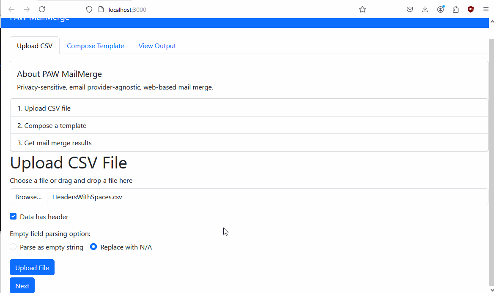

Setup:

1. Clone the repository

```
git clone https://github.com/Cat-1/paw-mailmerge.git
```

2. Navigate to paw-mailmerge.

```
cd paw-mailmerge
```

3. Install required libraries for the backend

```
npm install
```

4. Navigate to react-paw-mailmerge.

```
cd react-paw-mailmerge
```

5. Install libraries for react application

```
npm install
```

6. Build react application.

```
npm run build 
```

7. Navigate back to root directroy.

```
cd ..
```

8. Start backend server.

```
npm run start
```
